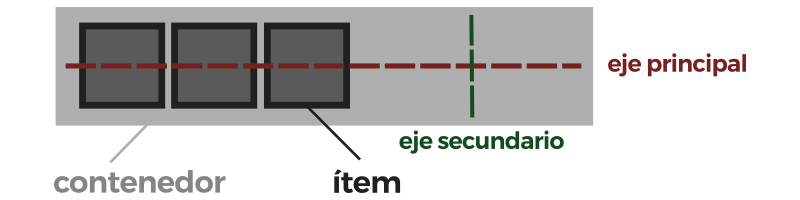

# Flexbox

Tradicionalmente, en CSS se ha utilizado el posicionamiento (static, relative, absolute...), los elementos en línea o en bloque (y derivados) o los float, lo que a grandes rasgos no dejaba de ser un sistema de creación de diseños bastante tradicional que no encaja con los retos que tenemos hoy en día (sistemas de escritorio, dispositivos móviles, múltiples resoluciones, etc...).

_Flexbox_ es un sistema de elementos flexibles que llega con la idea de olvidar estos mecanismos y acostumbrarnos a una mecánica más potente, limpia y personalizable, en la que los elementos HTML se adaptan y colocan automáticamente y es más fácil personalizar los diseños.

Resumiendo, el Módulo de Caja Flexible, o comúnmente llamado flexbox, fue diseñado como un modelo unidimensional de layout, y como un método que pueda ayudar a distribuir el espacio entre los ítems de una interfaz y mejorar las capacidades de alineación.

## Cómo funciona

Conceptos básicos que debemos dominar para entender el flexbox:

* Contenedor: Existe un elemento padre que es el contenedor que tendrá en su interior cada uno de los ítems flexibles y adaptables.
* Ítem: Cada uno de los hijos flexibles que tendrá el contenedor en su interior.
* Eje principal: Los contenedores flexibles tendrán una orientación principal específica. Por defecto, es en horizontal (fila). 
  El eje principal está definido por `flex-direction`, que posee cuatro posibles valores:
  * `row`
  * `row-reverse`
  * `column`
  * `column-reverse`

  Si elegimos `row` o `row-reverse`, el eje principal correrá a lo largo de la fila según la **dirección de la línea**.
  Al elegir `column` o `column-reverse` el eje principal correrá desde el borde superior de la página hasta el final — según la **dirección del bloque**.

* Eje secundario o cruzado: De la misma forma, los contenedores flexibles tendrán una orientación secundaria, perpendicular a la principal. Si la principal es en horizontal, la secundaria será en vertical, y viceversa.

### Líneas

Otra área vital de entendimiento es cómo flexbox no hace suposiciones sobre la manera de escribir del documento. En el pasado, CSS estaba muy inclinado hacia el modo de escritura horizontal y de izquierda a derecha. Los métodos modernos de layout acogen la totalidad de modos de escritura así que no es necesario asumir que una línea de texto empezará arriba del documento y correrá de izquierda a derecha, con nuevas líneas dispuestas una abajo de la otra.

Sin embargo la siguiente descripción debería ayudar para explicar porqué no se habla de izquierda y derecha ni de arriba o abajo a la hora de describir la dirección en la que fluyen los ítems flex. 

Si `flex-direction` es `row` y estoy trabajando en español, entonces el margen inicial del eje principal quedará a la izquierda, y el margen final a la derecha.

Si fuera a trabajar en árabe, entonces el margen inicial de mi eje principal quedaría a la derecha y el margen final a la izquierda.

Después de un tiempo, pensar en inicial y final en vez de izquierda y derecha se hará natural, y será útil cuando interactúe con otros métodos de layout tales como el _CSS Grid Layout_ que sigue los mismos patrones.

?> Este documento está en constante actualización, para más información por favor revisar documentación de referencia. 

## Referencias

- [Lenguajecss: Flexbox](https://lenguajecss.com/p/css/propiedades/flexbox)
- [W3Schools: Flexbox](https://www.w3schools.com/Css/css3_flexbox.asp)
- [Mozilla: Conceptos Basicos de Flexbox](https://developer.mozilla.org/es/docs/Web/CSS/CSS_Flexible_Box_Layout/Conceptos_Basicos_de_Flexbox)
- [The Complete CSS Flex Box Tutorial](https://medium.com/@js_tut/the-complete-css-flex-box-tutorial-d17971950bdc)
