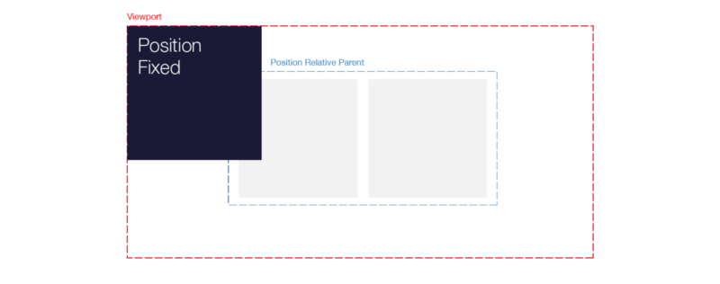

# Posiciones en CSS

Estoy al 100% de acuerdo con un artículo que he leído en Medium sobre cómo entender el posicionamiento en CSS., y hablo de la propiedad: `position`. El artículo "[Understanding Position in CSS](https://medium.com/@jacobgreenaway12/taming-the-css-beast-master-positioning-5882bad14458)" explica que desarrollar una comprensión de la propiedad de posición en CSS puede ser una de las experiencias más frustrantes para un principiante en el desarrollo web.

## Tipos

Hay dos tipos de posicionamiento: estático y relativo.

### Tipo Estático

Para el tipo de posicionamiento estático, solo tenemos un valor: `position: static;`. Es el valor que tienen los objetos por defecto. Muy rara vez vamosa ver éste tipo de posicionamiento declarado, ya que si no está declarado, el navegador tomará el valor por defecto, es decir, el estático.

### Tipo Relativo

Para el tipo de posicionamiento relativo, tenemos tres valores:
- `position: relative;`
- `position: absolute;`
- `position: fixed;`

Se denominan posiciones de tipo relativo porque permiten que los elementos se compensen en relación con ellos mismos, un elemento primario o el _viewport_, respectivamente.

#### Position: relative

Pensar en éste posicionamiento con la frase: "relativo a sí mismo". Creo que ésta imagen lo representa perfectamente:


Para llegar a ésta imagen, se usa este código CSS:

```css
.ourBox {
  position: relative;
  top: 20px;
  left: 20px;
}
```

Hay que recordar que cuando se usa ésta posición de un elemento con `position: relative;`, el espacio que ocupa no se mueve, por lo que no afectará nada a su alrededor.

#### Position: absolute


```css
.ourBoxesParent {
  position: relative;
}
.ourBox {
  position: absolute;
  top: 0;
  left: 0;
}
```

### Position: fixed



```css
.ourBox {
  position: fixed;  
  top: 0;
  left: 0;
}
```

## Recordar

- `position: static`

    Default positioning for all elements.  
    Puts element in normal flow.

- `position: relative`

    Can be offset with top, right, bottom and left.  
    Offset relative to itself.  
    Creates relative-type positioning context for children.

- `position: absolute`

    Can be offset with top, right, bottom and left.  
    Offset relative to its nearest relative-type positioned parent.  
    Creates relative-type positioning context for children.  

- `position: fixed`

    Can be offset with top, right, bottom and left.  
    Offset relative to the viewport.  
    Creates relative-type positioning context for children.

## Referencias

- [MDN Web Docs: positioning](https://developer.mozilla.org/en-US/docs/Web/CSS/position)
- [CSS Tricks: Absolute, relative, fixed positioning. How do they differ?](https://css-tricks.com/absolute-relative-fixed-positioining-how-do-they-differ/)
