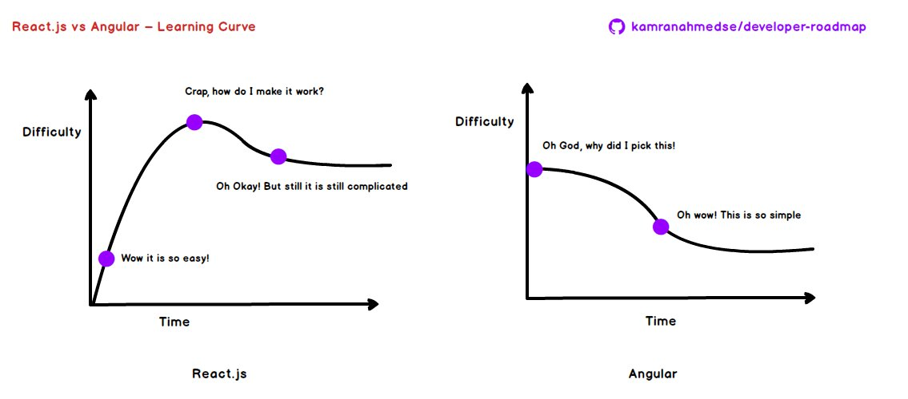

# Frontend Roadmap {docsify-ignore-all}

<!--  -->

## Frontend

Imperdible artículo sobre lo que hay que aprender para dominar el frontend de una web: [Modern Frontend Developer in 2018](https://medium.com/tech-tajawal/modern-frontend-developer-in-2018-4c2072fa2b9c).

Consejos que se desprenden de éste artículo:

- Aprender lo básico de HTML
  - DOM
- Aprender algo de [CSS](/c/css/)
  - Grid vs. Flexbox
  - Media Queries
  - Responsive Websites
- Aprender lo básico de [JavaScript](/c/js/)
  - Aprender sobre constructores básicos y la sintaxis.
  - Aprender a manipular el DOM
  - Aprender conceptos propios de JS, como _prototype_, _event bubbling_, etc.
  - Aprender AJAX (XHR)
  - Aprender ES6+ y sobre Javascript modular.
- ¿Aprender [Jquery](/c/jquery/)? - _Opcional_
- Gestión de paquetes
  - yarn
  - npm
- Preprocesadores CSS (CSS Preprocessors): agregan funcionalidad en la parte superior del CSS para permitir hacer cosas que con CSS no se podría. Hay que aprender cualquiera de éstos, y ver cómo funcionan:
  - SASS (se recomienda comenzar por éste)
  - PostCSS
  - Less
- CSS Frameworks (si bien no es necesario aprenderlos, es bueno saber que existen y lo que se puede lograr con ellos)
  - [Bootstrap](/c/bootstrap/)
  - Materialize CSS
  - Semantic UI
  - Bulma
- CSS Arquitecture - Si bien hay varias formas para definir la estructura del CSS, y dejar el código más manejable y fácil de mantener, las opciones son:
  - [BEM](/c/css/webs.md#bem) - (_Recomendado_)
  - OOCSS
  - SMACSS
  - SUITCSS
  - Atomic
- Build Tools
  - Linters
    - ESLint
    - JSLint
    - JSHint
    - JSCS
  - Bundlers
    - [Webpack](/c/js/webpack.md) - (_Recomendado para apps_) 
    - Rollup - (_Recomendado para librerías_)
    - Parcel
    - Browserify
  - NPM Scripts
    - Gulp
- Framework (JS)
  - React
    - Redux
    - Mobx
  - Vue
    - Vuex
  - [Angular](/c/angularjs/)
    - TypeScript
    - Rx.js
    - ngrx    
  _Curvas de aprendizaje React.js vs Angular_
  
- Progressive WebApps: [PWA](/c/pwa.md)
- Testing
  - Jest
  - Mocha
  - Karma
  - Enzyme
- Static Type Checkers
  >You don’t need to learn these but they really give you superpowers and can be learnt in a few hours and then you can keep . There is mainly _TypeScript_ and _Flow_.
- Server Side Rendering
- Todo lo que no se ha mencionado y seguir investigando:
  - HTML5 APIs
  - Canvas
  - SVG
  - SourceMaps
  - programación funcional
  - TC39
  - ... _etcetera!_

## Lecturas

- [Testing Your Frontend Code : Part I (Introduction)](https://hackernoon.com/testing-your-frontend-code-part-i-introduction-7e307eac4446)
- [Beginner’s Web Development Guide Part 1: Frontend](https://medium.com/devtrailsio/beginners-web-development-guide-part-1-frontend-ca59f1877ec5)
   

## Backend Roadmap

Imperdible la infografía del "[Backend Roadmap](/c/backend-roadmap.md)".

## Fuente

Este increíble trabajo es propiedad de [@kamranahmedse/developer-roadmap](https://github.com/kamranahmedse/developer-roadmap).
