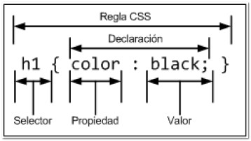

# Unidad 2

Antes de seguir deberías tener:

1. Uso básico de ordenadores, y uso pasivo de la Web (navegar y ver contenido).
1. Entorno básico de trabajo, leer [#Software Recomendado](/?id=software-recomendado).
1. Conocimiento básico de HTML y CSS. [_Repasar Uniodad 1_](/c/unidad1.md).

## Primer página web

Si bien en la [primer clase](/clases/clase1.md#clase-1) algo se vió, muy por arriba de la estructura básica y cómo una página debía llamar a los elementos que la componen, durante la [segunda clase](/clases/clase2.md#clase-2) se desarrolló con mayor profundidad lo que sería nuestro primer desarrollo web estático.

Se repasaron los conceptos de elementos `HTML` que ya habíamos visto; si aún no se sabe cuándo usar `<b>` o `<strong>`, recomiendo repasar el [Unidad 1](/c/unidad1.md#unidad-1). Y se ampliarán como veremos a continuación los conceptos con `CSS`.

?>A raíz de comprender mejor los ejemplos prácticos, el código que se practica en clase estará expuesto en una carpeta [`/www/` en GitHub](https://github.com/SidVal/dev.web/tree/master/www), y el comportamiento pueden verlo en [Fiddle](https://jsfiddle.net/Waldo/o31j84e1/) o bien en [Thimble](https://thimble.mozilla.org/es/user/walddo/1685329/); lee más sobre [Editores en Línea para practicar](https://github.com/SidVal/dev.web/wiki/Herramientas#editores-en-linea).

## CSS Introducción

Si bien en la documentación de clase hay mucho teórico, pueden ir completando los conocimientos con una lectura del sitio web de desarrolladores de Mozilla y su [introducción a CSS en español](https://developer.mozilla.org/es/docs/Learn/CSS/Introduction_to_CSS).

### Modelo de Cajas

En la documentación de clase se indica que todos los elementos HTML se interpretan por los navegadores web como cajas; así una página web es un grupo de cajas ordenadas siguiendo ciertas reglas. Entonces, cualquier elemento contenido en un documento web tiene la estructura de una _caja rectangular_ dentro del formato del documento, el tamaño y las capas que serán retocadas usando las propiedades CSS. Las propiedades importantes son: `margin`, `border`, `padding`, `width`, y `height`.

_Gráficamente_

#### `width` y `height`

Las propiedades `width` y `height` establecen el **ancho** y **alto** de la caja de contenido, que es el área donde se muestra el contenido de la caja — este contenido comprende tanto el texto incluido en la caja como otras cajas representadas por elementos anidados.

Para un manejo más refinado del tamaño de la caja, se usan propiedades adicionales como: `min-width`, `max-width`, `min-height`, y `max-height`.

#### `padding`

El `padding` hace referencia al margen interior de la caja CSS — entre el límite exterior de la caja del contenido y el límite interior del borde. El tamaño de esta capa puede configurarse en sus cuatro lados a la vez con la propiedad abreviada `padding`, o cada lado por separado con las propiedades: `padding-top`, `padding-right`, `padding-bottom` y `padding-left`.

#### `border`

El borde de una caja CSS descansa entre el límite exterior del padding y el límite interior del margen. Por defecto tiene un tamaño de `0` — es decir, invisible — pero podemos cambiar su grosor, estilo y color para hacerlo visible. La propiedad abreviada de `border` permite establecer los cuatro lados a la vez, por ejemplo: `border: 1px solid black`. Pero también se puede dividir en varias propiedades extendidas para su uso en necesidades concretas de estilo:

* `border-top`, `border-right`, `border-bottom` y `border-left`: establecen el grosor, estilo y color de cada lado del borde.
* `border-width`, `border-style`, `border-color`: establecen únicamente el grosor, el estilo y el color por separado, pero para los cuatro lados del borde al mismo tiempo.
* Podemos también establecer cada propiedad por separado para cada lado individualmente, usando `border-top-width`, `border-top-style`, `border-top-color`, y así...

#### `margin`

El margen envuelve la caja CSS, y sostiene a otras cajas del diseño. Se comporta como `padding`; la propiedad abreviada es `margin` y las propiedades individuales son `margin-top`, `margin-right`, `margin-bottom`, y `margin-left`.

### Reglas para ordenar las cajas

Dijimos que una página web es un grupo de cajas ordenadas siguiendo ciertas reglas. Éstas reglas son establecidas por los estilos. Estilos que pueden ser definidos por los navegadores web (estilos por defecto), o bien los programadores de las páginas web. La combinación de las distintas reglas se llama modelo, o sistema de disposición. Y todas las reglas aplicadas juntas, es lo que llamamos _modelo de caja_.

El _Modelo de Caja Tradicional_ es el único modelo que se considera estándar, pero hay otros modelos que están en etapas experimentales.

#### Regla CSS

Hay cinco (5) términos básicos que debemos dominar para cuando nos referimos a Hoja de Estilos (CSS):

* Regla

Cada estilo es una regla, y la regla en sí misma está compuesta por una parte de _selectores_, el símbolo de apertura `{`, la _declaración_, y el símbolo de cierre `}`.

* Selector

Indica el elemento (o los elementos) HTML a los que se aplica la regla CSS.

* Declaración

Indica los estilos que se aplican a los elementos. Está compuesta por una o más _propiedades_ CSS.

* Propiedad

Indica la característica que se modifica en el elemento seleccionado por el _selector_. Por ejemplo, el tamaño de letra, el color, etcétera.

* Valor

Indica el nuevo valor de la característica seleccionada.

_Gráficamente_

### Archivo CSS

Un archivo CSS puede contener un número ilimitado de reglas CSS. Cada regla puede aplicar a la cantidad de selectores que se desee.

## Formas de insertar estilos

Hay básicamente tres formas:

1. Estilos en línea
1. Estilos embebidos
1. Estilos en archivos externos

### Estilos en línea

Cuando se trabaja con estilos en línea se puede cambiar el estilo de determinado elemento HTML. Si por ejemplo queremos que en un párrafo, la letra tenga de tamaño _20px_ (por decir un número cualquiera), podemos ir a ese párrafo, al elemento `
` y modificarlo de la siguiente manera:

`
Esto sería un ejemplo de texto con tamaño de 20px
`

Ésta línea de estilo está "insertada" en el elemento HTML, modificando así su valor de estilo predeterminado que trae la página (y en caso de no traer, el navegador web interpreta que debería tener un tamaño "x").

?>[Practica tú mismo en este editor en línea](https://thimble.mozilla.org/es/anonymous/e4a2a72c-638a-42a8-b24f-575602250426/479820). Dale con confianza, la mejor forma de entender CSS es practicando y viendo cómo queda el resultado a medida que practicas.

### Estilos embebidos

### Estilos en archivos externos