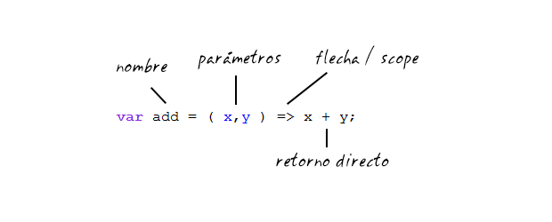

# Clase 4

>6 de Mayo - 2020

## Funciones

Funciones: conjunto de instrucciones agrupadas que se podrá reutilizar tantas veces lo necesitemos en distintos puntos del programa.

```js
    function nombre_funcion(parametros){ // el parámetro es una variable local
      instrucciones;
    }
```

Sin parámetro

```js
function saludar(){
    console.log("Hola");
  }
```
  
Con parámetros y argumentos
  
Parámetros: es la variable que se coloca en la definición de la función. Pueden recibir argumentos de cualquier tipo (números, string, etc)
  
Argumentos: es el valor actual que se envía a la función. Los argumentos llenan a los parámetros.
  
```js
  function suma(a,b){
    return a+b;
  }
  
  console.log(suma(2,3));
  
  //otro ejemplo
  
  let saludarPersonas = function(persona1, persona2, persona3){
    console.log("hola "+persona1)
    console.log("hola "+persona2)
    console.log("hola "+persona3)
  }
  saludarPersonas("Harry", "Ron", "Hermione")
```

Return: se encarga de devolver el resultado de la función al ser ejecutada. A su vez con ella termina la ejecución de una función por ende si luego de un return hay más líneas de código entonces ellas nunca se ejecutarán.
  
### SCOPE: ámbito

Hay dos tipos de scope:

- Global Scope: está disponible en todas las partes del código y no es muy recomendado.
- Local Scope: se crea para cada función cuando ella se ejecuta. Todo lo que está ahi solo vive mientras se ejecuta la función que se está usando. Y es más recomendable ya que evitamos errores.
  
```js
    var nombre= "Pepe";
  
    function saludo() {
      var nombre="Juanita";
      console.log(nombre)
    }
  
    saludo();
    console.log(nombre)  
```

Si inicializas una variable fuera, le das un valor dentro de la función y la retornas, el valor sera guardado en la variable

```js  
    var apellido;
    function retornoVariable (){
      apellido="Silva";
    return apellido;
    }
```  

Funciones anónimas: el conjunto de instrucciones no tiene nombre y se puede guardar dentro de una variable

```js  
    var electrodomesticos = function (nombre){
      return "El electrodoméstico es: "+ nombre;
    }
```
  
### Funciones de flecha

Las funciones flecha son una de las novedades ES6 (ECMAScript 2015) que más pueden desconcertar a los desarrolladores tradicionales. Su estructura intimida a simple vista y, de hecho, cuando nos las encontramos en un código sin avisar, pueden parecer incluso un error de sintaxis.

Pero como suele ocurrir, no son algo radicalmente nuevo: los programadores que conozcan por ejemplo la sintaxis de `CoffeeScript` se sentirán como en casa; es una estructura natural que resulta cómoda, menos redundante que la tradicional, y que de paso pretende solucionar los malentendidos que históricamente ha generado el maldito valor de `this` en Javascript.

```js  
    const nombreFuncion = (parametros) => {
      instrucciones de la función
      return valor
    }
  
  // 1er ejemplo: sin parámetro
  
  var saludo = () => {
    console.log("Hola");
  }  
  
  // Cuando tenemos una sola línea de código, podemos evitar las llaves
  let saludos = () => console.log("Hola");
  
  // 2do ejemplo: pasando un parámetro
  var electrodomestico = nombre => {
    return "El electrodoméstico es: "+ nombre;
  }
  console.log(electrodomestico("Tv"));
  
  // 3er ejemplo: sin return
  
  var suma = (a,b) => a+b
  console.log(suma(3,6));
```

#### Función Tradicional


#### Función Flecha



Con las funciones flecha, buscamos simplificar todo lo que teníamos en función tradicional de un modo mucho más directo y declarativo:

- Eliminamos la palabra reservada `function` y nos limitamos a recoger los parámetros mediante los paréntesis tradicionales.
- Podemos eliminar las llaves que delimitan el scope abriéndolo con una flecha.
- Podemos eliminar la palabra reservada `return`.

#### Importante en Funciones Flecha

- Las funciones flecha son siempre anónimas. Estamos utilizando una estructura declarativa donde asignamos la función a una variable. Eso nos permite su reutilación, pero por definición, estas funciones son anónimas.
- La sintaxis es mucho más limpia y simple. Superado el shock inicial de su estructura, rápidamente nos acostumbramos y la forma tradicional comienza a parecer verborreica.

?> Ampliar información sobre las funciones flecha en [Electro-Bóveda](https://electroboveda.blogspot.com/2019/02/typescript-funciones-de-flecha.html)

## Tarea

Enlazar a [`www`](https://sidval.github.io/www/curso/ns/claseJS4.html)
