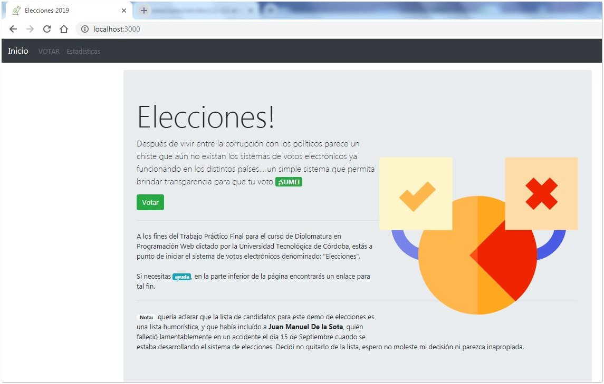
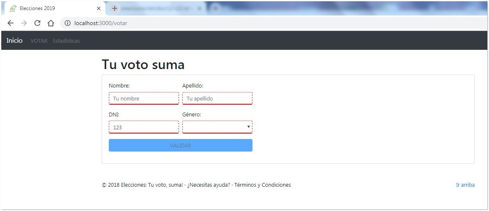
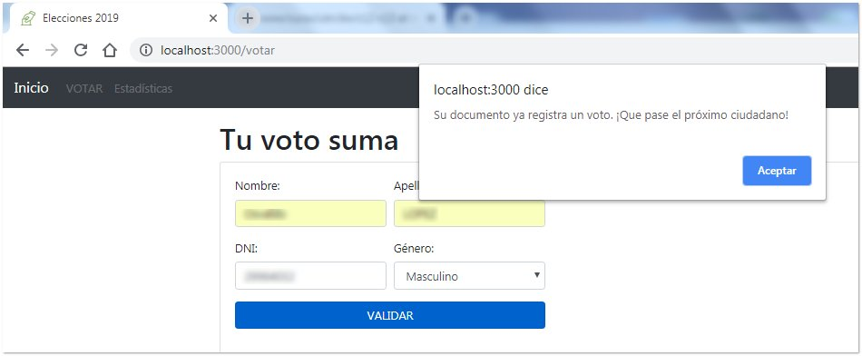
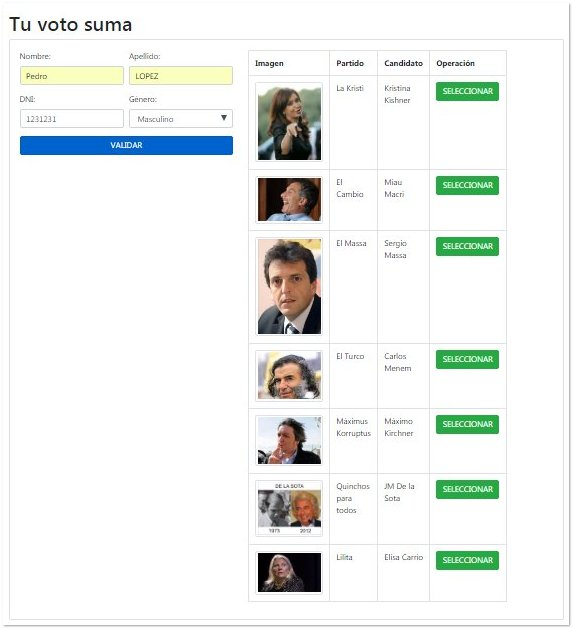
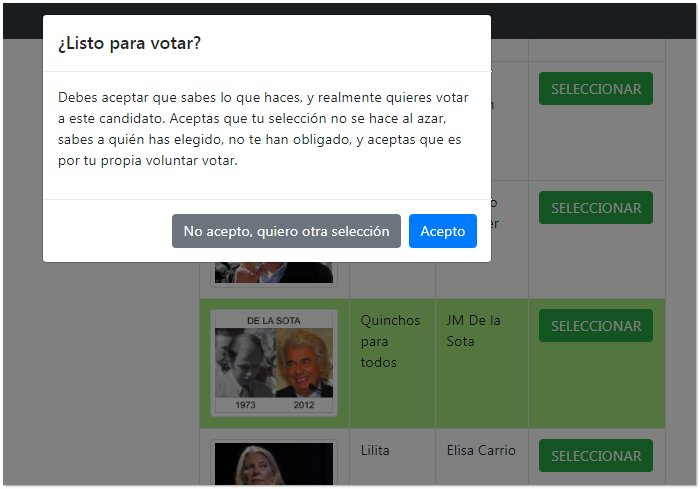
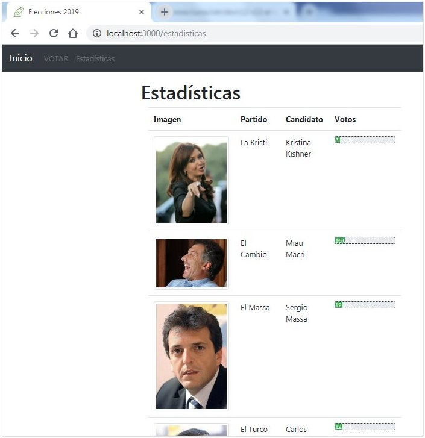

# Trabajo Final

## Investigación

- En la tarea, me encontré con la palabra "CRUD", y de la [primer lectura](https://fernando-gaitan.com.ar/crud-con-angular-node-js-y-mongodb-parte-1/) que hice sobre el tema, llegué a la conclusión de que CRUD es lo que busco, ya que es: `cómo agregar, listar, modificar y eliminar registros`.
- Si pasamos de buscar `abm node angular` a `crud node angular mongodb`, y a la vez le agregamos que queremos los resultados del último mes, en google, las cosas cambian. Para empezar, el término "ABM" es un término en español, así que los resultados en su mayoría son en ese idioma, mientras que buscando el término CRUD, la mayoría de los resultados están en inglés.
- En este tutorial [Angular Tutorial: Create a CRUD App with Angular CLI and TypeScript](https://adrianmejia.com/blog/2016/10/01/angular-2-tutorial-create-a-crud-app-with-angular-cli-and-typescript/), encontraremos la información que nos falta para cerrar muchos conceptos que en el curso estamos aprendiendo y nunca fueron explicados como debería haber sido.
- Otro buen tutorial que encontré es [Node.js MongoDB Tutorial with Examples](https://www.guru99.com/node-js-mongodb.html) donde explican en detalle cosas que a mi modo de ver deberían ser brindadas en este curso que he tomado. Hay buen material en ese sitio web, bien explicado, en detalle, especialmente la parte de código, qué es cada parte... si estamos iniciando, sin lugar a dudas es buen material.
- Este tuto usa otra base de datos, pero serviría para analizar: [Angular 6 HttpClient + Node.js/Express RestAPIs + MariaDB example | Sequelize ORM CRUD APIs example](https://grokonez.com/node-js/sequelize/angular-6-httpclient-node-js-express-restapis-mariadb-example-sequelize-orm-crud-apis-example)
- Encontré más con Mongoose: [Mongoose CRUD MongoDB – Angular 6 HttpClient Get/Post/Put/Delete – Node.js/Express RestAPIs](https://grokonez.com/frontend/angular/angular-6/angular-6-httpclient-get-post-put-delete-node-js-express-restapis-with-mongoose-crud-mongodb)
- [Building an Angular CRUD application step by step](https://medium.com/learn-angular/angular-tutorial-learn-angular-from-scratch-step-by-step-angular-5-tutorial-cf0600672418)

### Videos

- Hay videos en español que habría que evaluar: [1](http://www.faztweb.com/tutorial/nodejs-mongodb-crud), [2](http://www.faztweb.com/tutorial/crud-mean-angular-5), ...
- Seguir [este video](http://www.faztweb.com/curso/mean-stack) porque usa Angular

## Desarrollo

Me llevó bastante tiempo entender cómo funcionaba todo, y después de muchísimas horas y dos versiones, llegué a presentar "Elecciones v2" (puedes ver el código fuente aquí: [`www/testing/utn/dw/tfinal/elecciones - v2/`](https://github.com/SidVal/www/tree/master/testing/utn/dw/tfinal/elecciones%20-%20v2)).

### Instrucciones

Si lo descargas, necesitas ejecutar primero el: `npm i` para instalar todos los paquetes del node que necesita para correr. Luego abres la base de datos y ejecutas el `startmongo.bat` de la carpeta _data_ (requiere MongoDB), y finalmente cuando ya está corriendo la base de datos, en la terminal del _Visual Studio Code_ pones: `npm run dev` para que corra el _nodemon_ de desarrollo y puedas desarrollar en tiempo real con el _localhost_ a través de tu Google Chrome.

### Capturas de pantalla

**Inicio de la web:**



Es la presentación de la web, con textos descriptivos. Se aclara que la web es con tono de humor, y pese a que Juan Manuel de la Sota tuvo un terrible accidente donde falleció, se va a mantener como candidato expuesto en la aplicación web.

**Votar:**

Para el final teníamos que presentar un formulario que valide cada campo, por lo tanto si se completa algún campo con datos inválidos, se marca en focus con rojo:



**Validación:**

Si el usuario ya se encuentra en la base de datos, sale un aviso para que NO pueda votar y que siga otra persona:



**Votando:**

En el caso de que la persona no se encuentre en la base de datos, significa que puede votar. Entonces aparece un listado de candidatos para que seleccione su voto.



**Votando al candidato:**

Cuando se selecciona a un candidato, un aviso aparece para que el votante indique su consentimiento al voto.



**Estadísticas:**

Una vez que se vota, el candidato seleccionado suma un punto y pasa a las estadísticas. Con un progress-bar de bootstrap se muestra el avance hasta el momento.



***

## Calificación

>Como estás?, antes que nada gracias por haber cursado la diplomatura.
>
>Te cuento que estuve revisando tu examen y esta es mi devolución.
>
>Descargué e instalé los archivos que dejaste en Google drive y como no vi ningún archivo tipo README, decidí ver lo que enviaste para darme cuenta de como iniciar todo.
>
>Vi el directorio data y el startmongo.bat, por ende decidí arrancar la base de datos y anduvo de 10.
>
>Luego hice npm install donde estaba el package.json, se instalaron los archivos sin problemas, por último ejecuté npm start y arrancó el sitio con los mensajes que todo estaba corriendo correctamente.
>
>Me metí entonces a localhost:3000 y me encontré con tu página de inicio, muy buena!, con muy buen diseño responsiva e intuitiva, pasé a la página de votar y vi el formulario muy sobrio y con las validaciones pedidas de forma correcta, salvo que la validación del dni la hiciste por dni y sexo es decir que hice la votación con mi dni y sexo masculino y me dejó votar, use el back del browser y cambié el sexo a femenino y también me dejó votar con el mismo dni y distinto sexo, creo que solo el dni era suficiente para evitar votos duplicados, pero más allá de eso la validación funciona.
>
>El formulario de votación es el mismo solo que hiciste visible la lista de candidatos, bien resuelto por cierto, pero tampoco era lo pedido, se pedía hacerlo en otra página y pasar el parámetro de dni de alguna manera, pero no importa la tuya es una solución válida que evita el problema del manejo de variables entre páginas (ya sea por parámetro, session o storage), lo que no quedó tan bien es que la lista de candidatos no renderiza bien en resoluciones mas pequeñas se corta un poco los elementos pero se puede usar así que no es un impedimento al fin.
>
>Luego de votar pasa al formulario de estadísticas que se ve bastante bien, resolviste bien la captura de los datos salvo que vi que pusiste `Votos.find({numeroCandidato: 1}).countDocuments();` lo cual estas haciendo 2 querys a la base de mongo, uno para el filtrado y otro para el conteo, cuando podrías haberlo resuelto tan solo usando `Votos.countDocuments({numeroCandidato: 1});` en una sola llamada, es mejor, lo otro que veo que no pudiste lograr es lo de mostrar los datos ordenados de mayor a menor, esto lo podrias haber resuelto si usabas esta función en el _Ajax_:
>
>
> ```
$.ajax({

                url: '/api/porcentajes',

                method: "GET",

                type: "JSONP",

                success: function(data) {

                    const porc = JSON.parse(data);

                    console.log(porc);

                    //$(".progress > .progress-bar").css("width", resp + "%").text(resp + " %");

                    $.each(porc, function(index, value) {

                        $('.progress-bar').eq(index).attr("votos", value).css("width", value + "%").text(value + " %");

                    });

 

                    $('tbody').html($('tbody tr').sort(function(a, b) {

                        return $(b).find('.progress-bar').attr('votos') - $(a).find('.progress-bar').attr('votos')

                   }));

 

                },

                error: function(jqXHR, status, error) {

                    alert('Hubo un error: ' + jqXHR + '-' + error);

                    //$('#listaCandidatos').removeClass('d-none');

                    console.log("Error: " + error);

                }

            });
```
>
>Fijate que primero aggregué el dato de los porcentajes de votos en un attributo “votos” para luego usarlo con el sort que está mas abajo y reemplazarlo en el tbody.
>
>Con eso solamente se ordenan los datos.
>
>Veo que usaste `EJS` para usar templates de HTML, eso no estaba en el programa ya que íbamos a usar `Angular` para hacer eso, pero bien resuelto y funciona correctamente.
>
>El esquema de los datos también es el adecuado el usar `await` y `async` para eliminar los `callbacks` es algo que también no estaba en el curso dado que es un nuevo estándar que se aprobó para el `ES7` y nosotros estábamos trabajando con `ES6`, pero muy bien por haberlo usado, eso muestra inventiva a la hora de resolver problemas.
>
>Creo que salvo por el problema de renderizado de la lista de candidatos y resultados y la validación del `dni + sexo` en vez de solo `dni` el resto está perfecto, pero se compensa con el uso del `ejs` y el estándar de `ES7`.
>
> **Tu nota es un 10 (diez).**
>
>Pronto la gente de la facultad se estará comunicando contigo para hacerte entrega del diploma correspondiente.
>
>Espero te haya gustado el curso, creo que ya estas listo para ir por `Angular 5`!, espero este curso te sirva para lo que tengas planeado a futuro.
>
>Por mi lado decirte que he disfrutado mucho en dar estas clases y espero nos veamos en alguna otra diplomatura.
>
>Te dejo un link a una encuesta para evaluar la cursada, sentite libre de decirnos lo que quieras.
>_Enlace a la encuesta_
>
>Saludos.
>
>Lic. Mario Di Giorgio
