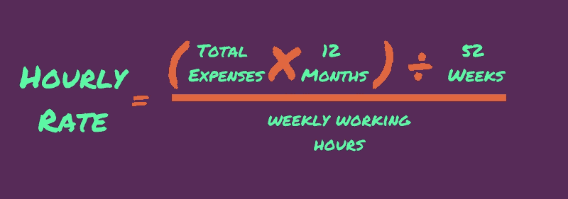

# Freelance

## Lecturas

- [Want To Be a Better Developer? Work in UX](https://medium.com/swlh/want-to-be-a-better-developer-work-in-ux-33a040970bcb) ☆
  - Start with the MVP  
    Primero, cree el MVP (producto viable mínimo) para que los usuarios vean que pueden lograr lo que necesitan y luego agregue sus características sofisticadas.
  - You need to talk to people
  - Throw away your surveys, because you need interviews
  - Good user experience breeds successful engineering
- [Why Developers Become Frustrated And Companies Can’t Find Talent](https://codeburst.io/why-developers-become-frustrated-and-companies-cant-find-talent-c4114d8b72ac)
  - There are 3 attributes necessary for a software project to succeed: Time, Money and Quality.
  - Senior devs tend to suffer burnout because they feel that they’re always hired to fix somebody else’s mistake other than build new things.
  - ... to acquire more experience you need to have… experience!
  - In order to survive, a software project needs to sacrifice quality for money and time. In order to exist, a software project needs to sacrifice money and time for quality.
- [3 big lessons from failing as a freelancer](https://medium.com/@theodorosspathas/3-big-lessons-from-failing-as-a-freelancer-42f52f52f9ba) ☆  
  - Lesson №1: Never run out of money
  - Lesson №2: When you do run out of money, be flexible
  - Lesson №3: If you are going to take risks, first protect the downside
- [How to price your services as a freelance writer](https://medium.com/swlh/how-to-price-your-services-as-a-freelance-writer-8984d76b3158) ☆  
  
- [I have an App Idea… but I’m not a Programmer](https://hackernoon.com/i-have-an-app-idea-but-im-not-a-programmer-77327fe448c3)
