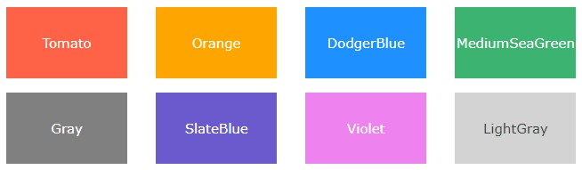
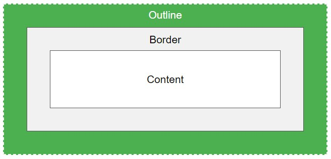

# Unidad 2

Antes de seguir deberías tener:

1. Uso básico de ordenadores, y uso pasivo de la Web (navegar y ver contenido).
1. Entorno básico de trabajo, leer [#Software Recomendado](/?id=software-recomendado).
1. Conocimiento básico de HTML y CSS. [_Repasar Unidad 1_](/u/unidad1.md).

## Primer página web

Si bien en la [primer clase](/clases/clase1.md#clase-1) algo se vió, muy por arriba de la estructura básica y cómo una página debía llamar a los elementos que la componen, durante la [segunda clase](/clases/clase2.md#clase-2) se desarrolló con mayor profundidad lo que sería nuestro primer desarrollo web estático.

Se repasaron los conceptos de elementos `HTML` que ya habíamos visto; si aún no se sabe cuándo usar `<b>` o `<strong>`, recomiendo repasar el [Unidad 1](/u/unidad1.md#unidad-1). Y se ampliarán como veremos a continuación los conceptos con `CSS`.

?>A raíz de comprender mejor los ejemplos prácticos, el código que se practica en clase estará expuesto en una carpeta [`/www/` en GitHub](https://github.com/SidVal/dev.web/tree/master/www), y el comportamiento pueden verlo en [Fiddle](https://jsfiddle.net/Waldo/o31j84e1/) o bien en [Thimble](https://thimble.mozilla.org/es/user/walddo/1685329/); lee más sobre [Editores en Línea para practicar](https://github.com/SidVal/dev.web/wiki/Herramientas#editores-en-linea).

## CSS Introducción

Si bien en la documentación de clase hay mucho teórico, pueden ir completando los conocimientos con una lectura del sitio web de desarrolladores de Mozilla y su [introducción a CSS en español](https://developer.mozilla.org/es/docs/Learn/CSS/Introduction_to_CSS).

### Modelo de Cajas

En la documentación de clase se indica que todos los elementos HTML se interpretan por los navegadores web como cajas; así una página web es un grupo de cajas ordenadas siguiendo ciertas reglas. Entonces, cualquier elemento contenido en un documento web tiene la estructura de una _caja rectangular_ dentro del formato del documento, el tamaño y las capas que serán retocadas usando las propiedades CSS. Las propiedades importantes son: `margin`, `border`, `padding`, `width`, y `height`.

_Gráficamente_


#### Ancho y alto

Las propiedades `width` y `height` establecen el **ancho** y **alto** de la caja de contenido, que es el área donde se muestra el contenido de la caja — este contenido comprende tanto el texto incluido en la caja como otras cajas representadas por elementos anidados.

Para un manejo más refinado del tamaño de la caja, se usan propiedades adicionales como: `min-width`, `max-width`, `min-height`, y `max-height`.

#### Espacio interno

El `padding` hace referencia al margen interior de la caja CSS — entre el límite exterior de la caja del contenido y el límite interior del borde. El tamaño de esta capa puede configurarse en sus cuatro lados a la vez con la propiedad abreviada `padding`, o cada lado por separado con las propiedades: `padding-top`, `padding-right`, `padding-bottom` y `padding-left`.

#### Linea de Borde

El borde de una caja CSS descansa entre el límite exterior del padding y el límite interior del margen. Por defecto tiene un tamaño de `0` — es decir, invisible — pero podemos cambiar su grosor, estilo y color para hacerlo visible. La propiedad abreviada de `border` permite establecer los cuatro lados a la vez, por ejemplo: `border: 1px solid black`. Pero también se puede dividir en varias propiedades extendidas para su uso en necesidades concretas de estilo:

* `border-top`, `border-right`, `border-bottom` y `border-left`: establecen el grosor, estilo y color de cada lado del borde.
* `border-width`, `border-style`, `border-color`: establecen únicamente el grosor, el estilo y el color por separado, pero para los cuatro lados del borde al mismo tiempo.
* Podemos también establecer cada propiedad por separado para cada lado individualmente, usando `border-top-width`, `border-top-style`, `border-top-color`, y así...

?> [Ampliar más información de la propiedad `border`](#border)

#### Margen

El margen envuelve la caja CSS, y sostiene a otras cajas del diseño. Se comporta como `padding`; la propiedad abreviada es `margin` y las propiedades individuales son `margin-top`, `margin-right`, `margin-bottom`, y `margin-left`.

### Reglas para ordenar las cajas

Dijimos que una página web es un grupo de cajas ordenadas siguiendo ciertas reglas. Éstas reglas son establecidas por los estilos. Estilos que pueden ser definidos por los navegadores web (estilos por defecto), o bien los programadores de las páginas web. La combinación de las distintas reglas se llama modelo, o sistema de disposición. Y todas las reglas aplicadas juntas, es lo que llamamos _modelo de caja_.

El _Modelo de Caja Tradicional_ es el único modelo que se considera estándar, pero hay otros modelos que están en etapas experimentales.

#### Regla CSS

Hay cinco (5) términos básicos que debemos dominar para cuando nos referimos a Hoja de Estilos (CSS):

* Regla

Cada estilo es una regla, y la regla en sí misma está compuesta por una parte de _selectores_, el símbolo de apertura `{`, la _declaración_, y el símbolo de cierre `}`.

* Selector

Indica el elemento (o los elementos) HTML a los que se aplica la regla CSS.

* Declaración

Indica los estilos que se aplican a los elementos. Está compuesta por una o más _propiedades_ CSS.

* Propiedad

Indica la característica que se modifica en el elemento seleccionado por el _selector_. Por ejemplo, el tamaño de letra, el color, etcétera.

* Valor

Indica el nuevo valor de la característica seleccionada.

_Gráficamente_


### Archivo CSS

Un archivo CSS puede contener un número ilimitado de reglas CSS. Cada regla puede aplicar a la cantidad de selectores que se desee.

## Formas de insertar estilos

Hay básicamente tres formas:

1. Estilos en línea
1. Estilos embebidos
1. Estilos de archivos externos

### Estilos en línea

Cuando se trabaja con estilos en línea se puede cambiar el estilo de determinado elemento HTML. Si por ejemplo queremos que en un párrafo, la letra tenga de tamaño _20px_ (por decir un número cualquiera), podemos ir a ese párrafo, al elemento `<p>` y modificarlo de la siguiente manera:

`<p style="font-size:20px;">Esto sería un ejemplo de texto con tamaño de 20px</p>`

Ésta línea de estilo está "insertada" en el elemento HTML, modificando así su valor de estilo predeterminado que trae la página (y en caso de no traer, el navegador web interpreta que debería tener un tamaño "x").

?>[Practica tú mismo en este editor en línea](https://jsfiddle.net/Waldo/6oxxu5p0/). Dale con confianza, la mejor forma de entender CSS es practicando y viendo cómo queda el resultado a medida que practicas.

### Estilos embebidos

¿Qué ocurriría si tenemos mil párrafos y queremos que cada uno tenga letra de _20px_? ¿Te imaginas editando cada elemento `<p>` del código HTML para insertar a cada línea un estilo que modifique el tamaño de la letra al tamaño que necesitemos?

Para evitar ésta situación, se puede insertar estilos de forma embebida dentro del documento HTML, en la parte del `<head>` (fuera del `<body>`), así:

```html
<head>
<style>
    p {font-size:20px;}
    </style>
</head>
<body>
<p>Esto sería un ejemplo de texto que irá en 20px porque todos los elementos "p" tienen ahora ese tamaño.</p>
</body>
```

### Estilos de archivos externos

Si bien tener los estilos embebidos es la mejor forma de tener estilos en cada página, porque podemos personalizar y gestionar cada estilo directamente desde la página en sí, sin tener que insertar a cada elemento HTML el estilo, ¿qué pasaría si tendríamos 100 páginas HTML donde replicar todos los estilos?.

Para evitar tener que copiar y pegar en cada página los _estilos embebidos_, se usan los estilos de archivos externos. Es decir, tendremos todo el estilo en un archivo propiamente de "estilo", con extensión `.css` que podrá ser linkeado (o enlazado o mejor dicho, insertado) en cualquier página HTML que lo llame a través del elemento [`<link>`](https://www.w3schools.com/tags/tag_link.asp).

> Tener en cuenta que:
> * en HTML5 el elemento `<link>` no requiere cierre, pero si usamos XHTML sí necesita ser cerrado.
> * el elemento `<link>` solo contiene atributos, no debe contener texto de ningún tipo.
> * `rel` es atributo obligatorio.
> * debe ir en la sección `<head>` del documento HTML, pero puede haber muchos elementos `<link>` en dicha sección.

Entonces para insertar estilos de archivos externos debemos poner en la sección `<head>` la siguiente línea:
`<link rel="stylesheet" href="../css/estilos.css">`

En la unidad 1 vimos el elemento `<link>` cuando hablamos de las etiquetas html del "HEAD", que serviría para insertar nuestra página llamada "estilos.css" a nuestra primer página web. _Repasar unidad sobre el [link](/u/unidad1.md#link)_.

## Referencias

Comenzaremos con tres formas para referenciar elementos HTML desde reglas CSS:

* Referencia por palabra clave del elemento
* Referencia por el atributo id
* Referencia por el atributo class

### Referencia por palabra clave

Al utilizar la referencia por palabra clave del elemento HTML, cambiamos todos los elementos afectados en la página HTML, por ejemplo el que veníamos usando: `p {font-size:20px;}`. Lo que hará ésta referencia es que todos los elementos de párrafo (`<p>`) en un documento HTML pasen a tener tamaño 20px.

### Referencia por el atributo id

Como vimos en la unidad 1, el [atributo id](/u/unidad1.md/#id) debe ser utilizado para "identificar" cierto elemento HTML, y dicha identidad debe ser única dentro del documento. En CSS, para la regla a un ID, se identifica con un _hash_ (símbolo _#_).

```css
#principal {
  font-size: 30px;
  color: green;
  font-style: italic;
  text-decoration-color: red;
  text-decoration-line: underline;
  text-decoration-style: double;
}
```

`<p id="principal">Texto principal</p>`

?>[Hazlo tú mismo aquí](https://jsfiddle.net/Waldo/6oxxu5p0/2/).

### Referencia por el atributo class

También vimos el [atributo class](/u/unidad1.md#class) en la unidad 1, que servía para dar estilo ciertos elementos HTML que no eran únicos, y que se comportaban de forma similar (hablando de estilos). Por ejemplo, si tendríamos párrafos con texto secundario, podemos definir un class _secundario_ y darle ciertos estilos:

```css
.secundario {
  font-size: 15px;
  color: gray;
}
```

Un párrafo secundario de ejemplo:

```html
<p class="secundario">
Lorem ipsum dolor sit amet, consectetur adipiscing elit. Cras dapibus est convallis erat ultricies commodo. Cras elementum volutpat eros id luctus. Nullam et turpis at nisl condimentum ultrices. Sed et ex tincidunt, dictum eros convallis, dictum elit. Lorem ipsum dolor sit amet, consectetur adipiscing elit. Maecenas ut feugiat massa, vitae auctor velit. Aenean vel purus in velit egestas porta id nec elit. Cras eu diam vehicula metus volutpat elementum quis placerat libero. In hac habitasse platea dictumst. Etiam aliquet lorem pulvinar felis pharetra, vitae lobortis magna feugiat. Nam aliquet tortor a metus feugiat, in scelerisque libero congue. Sed at ante dictum, vestibulum ipsum sit amet, dictum felis. Aliquam nisi lacus, vehicula eget risus sit amet, eleifend viverra ipsum. Mauris id sodales lacus, eget faucibus nisi.</p>
```

?>[Hazlo tú mismo aquí](https://jsfiddle.net/Waldo/6oxxu5p0/3/).

También se podría crear el estilo solo para elementos `<p>`, y no para otros elementos que tengan la clase "secundario" (siguiendo nuestro ejemplo práctico).

Si al estilo lo cambiamos así:

```css
p.secundario {
  font-size: 15px;
  color: gray;
}
```

Aplicará a aquellos párrafos que tengan el `<p class="secundario">` pero si hay un `<div>` que tiene la misma clase, no tendrá el estilo.

?>[Hazlo tú mismo ahora](https://jsfiddle.net/Waldo/6oxxu5p0/4/).

## Nuevos métodos de referencia

* Selector Universal
* Referencia de cualquier atributo
* Referencia con pseudo clases
* Referencia con pseudo elementos

### Selector Universal

En la documentación del curso se menciona al selector universal únicamente cuando hablamos de la [_referencia a cualquier atributo_](#referencia-a-cualquier-atributo). Considero que debe ser tomado en cuenta como otro método de referencia, ya que se brinda estilos a través del selector universal, y debe ser tenido en cuenta para aprender CSS3.

El selector universal `*` es el mejor _comidín_. Permite seleccionar todos los elementos en una página. Como rara vez es útil aplicar un estilo a cada elemento de una página, a menudo se utiliza en combinación con otros selectores (consulte Combinators a continuación).

Ejemplo de selector universal:

```css
* {
  padding: 5px;
  border: 1px solid black;
  background: rgba(255,0,0,0.25)
}
```

!>Tenga cuidado al usar el selector universal. Como se aplica a todos los elementos, su uso en grandes páginas web puede tener un impacto perceptible en el rendimiento: las páginas web se muestran más despacio de lo esperado. No hay muchas instancias en las que use este selector universal.

### Referencia a cualquier atributo

!>Más conocidos como ["Selectores de Atributos"](https://www.w3schools.com/css/css_attribute_selectors.asp).

Los selectores de atributos son un tipo especial de selector que unirá elementos en función de sus atributos y valores de atributo. Su sintaxis genérica consta de corchetes `[ ]` que contienen un nombre de atributo seguido de una condición opcional para coincidir con el valor del atributo.

Los selectores de atributos se pueden dividir en dos categorías según la forma en que coincidan con los valores de los atributos:

* Selectores de atributos de presencia y valor
* Selectores de atributos de valor de subcadena

#### Selector de atributos de presencia y valor

Éstos selectores de atributos tratarán de hacer coincidir el valor exacto del atributo (o bien cualquier atributo mencionado):

* `[name]`: este selector actuará sobre todos los elementos que tengan el atributo `name` sin importar si tiene o no valor.
* `[name=val1]`: este selector actuará sobre todos los elementos que tengan el atributo `name` con el valor `val1`.
* `[name~=val2]`: este selector actuará sobre todos los elementos que tengan el atributo `name` pero únicamente sobre los que tengan el valor `val2` separado por un espacio.

?> [Ver ejemplo práctico](https://jsfiddle.net/Waldo/6oxxu5p0/8/)

!> Para uso más avanzado, si se quiere usar el atributo `data`, existen los "[data attributes](https://developer.mozilla.org/en-US/docs/Learn/HTML/Howto/Use_data_attributes)" que pueden ser manipulados con _JavaScript_.

#### Selector de atributo de valor de subcadena

Los selectores de atributos en esta clase también se conocen como "selectores similares a RegExp", ya que ofrecen una coincidencia flexible de forma similar a la expresión regular (pero, para que quede claro, estos selectores no son verdaderas expresiones regulares):

* `[attr|=val]`: este selector actuará sobre todos los elementos con el atributo `attr` donde el valor es exactamente `val` o comienza con `val-` (cuidado, el guión aquí no es un error, esto es para manejar los códigos de idioma).
* `[attr^=val]`: este selector actuará sobre todos los elementos con el atributo `attr` donde el valor comienza con `val`.
* `[attr$=val]`: este selector actuará sobre todos los elementos con el atributo `attr` donde el valor termina con `val`.
* `[attr*=val]`: este selector actuará sobre todos los elementos con el atributo `attr` donde el valor contiene la palabra `val` (es distinto a `[attr~=val]` donde el selector no trata los espacios como valores sino como parte del valor del atributo).

##### Prácticas de Selectores de Atributos

Haremos un ejemplo con listas, para entender mejor cómo trabajan todos los _selectores de atributos_ que hemos desarrollado hasta aquí.

<script async src="//jsfiddle.net/Waldo/n5qcos5z/embed/html,css,result/"></script>

### Referencia con pseudo clases

En la documentación del curso (aún no se ha dado en profundidad en alguna práctica) está muy compleja la explicación sobre pseudo-clases. En el curso, recién en la última parte de la [clase 2](/curso/clase2.md) y la [clase 3](/curso/clase3.md) se mencionaron las pseudo-clases `:focus` y `:after` (en la clase 2) y se agregó `:hover` en la clase 3, aunque no se mencionó ni se presentó el tema como tal, sino que se hablaba de darle estilo a la acción del mouse arriba de los enlaces.

?> Ampliar información sobre [Pseudo Clases](/c/css/pseudo-clases.md).

### Referencia con pseudo elementos

?> Ampliar información sobre [Pseudo Elementos](/c/css/pseudo-elementos.md).

## Nuevos selectores

En el curso, se vieron éstos "nuevos selectores":

* Selector `>`
* Selector `+`
* Selector `~`

Sin embargo, en la referencia de cualquier sitio que hable sobre CSS éstos son combinadores (CSS Combinators).

?> Ampliar información sobre [Combinadores CSS](/c/css/combinadores.md).

## Bordes

En clase se vieron éstas propiedades de bordes:

* [`border`](///border.md)](/c/css/border.md)
* [`border-radius`[](/c/css/border-radius.md)
* [`border-image`](/c/css/border-image.md)

## Box Shadow

La propiedad `box-shadow` permite realizar **sombras** con estilos css. Requiere al menos tres valores: _color_, _desplazamiento horizontal_, y _desplazamiento vertical_. Un cuarto valor sería para _difuminar_ la sombra. Si agregamos un quinto valor, será para darle profundidad, podría ser el valor: `inset` si queremos que la sombra sea interna.

Ejemplo para crear _efecto blur_: `box-shadow: 10px 10px 8px #888888;`

Recomiendo ver algunos [ejemplos avanzados de `box-shadow`](https://www.w3schools.com/cssref/css3_pr_box-shadow.asp) para mejorar su comprensión.

## Text Shadow

Por ejemplo: `text-shadow: 2px 2px #ff0000;` hará que el texto tenga sombra. [Ver en linea](https://www.w3schools.com/cssref/tryit.asp?filename=trycss3_text-shadow).

[Ver más ejemplos de `text-shadow`](https://www.w3schools.com/cssref/css3_pr_text-shadow.asp).

## Font Face

La propiedad `@font-face` nos permite tener una fuente especificada desde cualquier ubicación.

La propiedad requiere que se defina el valor para la `font-family` y el _source_, es decir el valor de dónde viene la fuente que queremos llamar, con `src`.

Ejemplo [-ver en linea](https://www.w3schools.com/cssref/tryit.asp?filename=trycss3_font-face_rule):

```css
@font-face {
    font-family: myFirstFont;
    src: url(sansation_light.woff);
}
```

## Fondos

### Background

Las propiedades de fondo de CSS se usan para definir los efectos de fondo para los elementos.

Propiedades de fondo de CSS [-ampliar](https://www.w3schools.com/css/css_background.asp):

* `background-color`
* `background-image`
* `background-repeat`
* `background-attachment`
* `background-position`

En clase de dio el método _"shorthand"_. Se da cuando se acorta el código, es decir, es posible especificar todas las propiedades de fondo en una sola propiedad. Esto se llama una propiedad _shorthand_.

Ejemplo: `background: #ffffff url("img_tree.png") no-repeat right top;` [-ver](https://www.w3schools.com/css/tryit.asp?filename=trycss_background_shorthand).

### Gradientes CSS

Los gradientes son configurados como fondos degradados. En la documentación de clase aparece como _Gradiente Lineal_.

Los degradados CSS le permiten mostrar transiciones suaves entre dos o más colores especificados.

CSS define dos tipos de degradados:

* Degradados lineales (baja / sube / izquierda / derecha / diagonalmente)
* Degradados radiales (definidos por su centro)

#### Linear Gradient

Para crear un degradado lineal, debe definir al menos dos paradas de color. Las paradas de color son los colores con los que desea hacer transiciones suaves. También puede establecer un punto de inicio y una dirección (o un ángulo) junto con el efecto de degradado.

Ejemplos:

* Arriba Abajo (default): `background: linear-gradient(red, yellow);` [-ver](https://www.w3schools.com/css/tryit.asp?filename=trycss3_gradient-linear)
* Izquierda a Derecha: `background: linear-gradient(to right, red , yellow);` [-ver](https://www.w3schools.com/css/tryit.asp?filename=trycss3_gradient-linear_ltr)
* Diagonal: `background: linear-gradient(to bottom right, red, yellow);` [-ver](https://www.w3schools.com/css/tryit.asp?filename=trycss3_gradient-linear_diagonal)

Si desea más control sobre la dirección del degradado, puede definir un ángulo, en lugar de las direcciones predefinidas (hacia abajo, hacia arriba, hacia la derecha, hacia la izquierda, hacia abajo a la derecha, etc.).

* Con ángulos: `background: linear-gradient(-90deg, red, yellow);` [-ver](https://www.w3schools.com/css/tryit.asp?filename=trycss3_gradient-linear_angles)
* Con múltiples colores: `background: linear-gradient(red, yellow, green);` [-ver](https://www.w3schools.com/css/tryit.asp?filename=trycss3_gradient-linear_cs)
* Otro ejemplo de múltiples colores: `background: linear-gradient(to right, red,orange,yellow,green,blue,indigo,violet);` [-ver](https://www.w3schools.com/css/tryit.asp?filename=trycss3_gradient-linear_rainbow)
* Repitiendo colores: `background: repeating-linear-gradient(red, yellow 10%, green 20%);` [-ver](https://www.w3schools.com/css/tryit.asp?filename=trycss3_gradient-linear_repeating)

Los degradados de CSS también admiten **transparencia**, que se puede usar para crear efectos de _desvanecimiento_. Para agregar transparencia, usamos la función `rgba()` para definir las paradas de color. El último parámetro en la función `rgba()` puede ser un valor de 0 a 1, y define la transparencia del color: 0 indica transparencia total, 1 indica color completo (sin transparencia). El siguiente ejemplo muestra un gradiente lineal que comienza desde la izquierda. Comienza completamente transparente, pasando a rojo:  `background: linear-gradient(to right, rgba(255,0,0,0), rgba(255,0,0,1));` [-ver](https://www.w3schools.com/css/tryit.asp?filename=trycss3_gradient-linear_trans).

#### Radial Gradient

Un gradiente radial se define por su centro. Para crear un degradado radial también debe definir al menos dos paradas de color.

* Radial de color uniformemente espaciados: `background: radial-gradient(red, yellow, green);` [-ver](https://www.w3schools.com/css/tryit.asp?filename=trycss3_gradient-radial)
* Paradas de color diferentes espaciadas: `background: radial-gradient(red 5%, yellow 15%, green 60%);` [-ver](https://www.w3schools.com/css/tryit.asp?filename=trycss3_gradient-radial2)
* Establecer forma: `background: radial-gradient(circle, red, yellow, green);` [-ver](https://www.w3schools.com/css/tryit.asp?filename=trycss3_gradient-radial_shape)
* Repitiendo radiales: `background: repeating-radial-gradient(red, yellow 10%, green 15%);` [-ver](https://www.w3schools.com/css/tryit.asp?filename=trycss3_gradient-radial_repeating)

## Colores

Los colores en CSS se especifican utilizando nombres de colores predefinidos o valores RGB, HEX, HSL, RGBA, HSLA.

### Colores Predefinidos

En HTML, un color se puede especificar mediante el uso de un nombre de color:



HTML admite 140 nombres de colores estándar.

### RGBA

Los valores de color RGBA son una extensión de los valores de color RGB con un canal alfa, que especifica la opacidad para un color. Un valor de color RGBA se especifica con: `rgba(red, green, blue, alpha)`. El parámetro _alfa_ es un número entre 0.0 (totalmente transparente) y 1.0 (totalmente opaco).

Ejemplo [-ver en línea](https://www.w3schools.com/css/tryit.asp?filename=trycss3_color_rgba):

```css
#p1 {background-color: rgba(255, 0, 0, 0.3);}  /* red with opacity */
#p2 {background-color: rgba(0, 255, 0, 0.3);}  /* green with opacity */
#p3 {background-color: rgba(0, 0, 255, 0.3);}  /* blue with opacity */
```

### HSLA

Los valores de color HSLA son una extensión de los valores de color HSL con un canal alfa, que especifica la opacidad para un color. Un valor de color HSLA se especifica con: `hsla(hue, saturation, lightness, alpha)`, donde el parámetro _alfa_ define la opacidad. El parámetro alfa es un número entre 0.0 (totalmente transparente) y 1.0 (totalmente opaco).

Ejemplo [-ver en linea](https://www.w3schools.com/css/tryit.asp?filename=trycss3_color_hsla):

```css
#p1 {background-color: hsla(120, 100%, 50%, 0.3);}  /* green with opacity */
#p2 {background-color: hsla(120, 100%, 75%, 0.3);}  /* light green with opacity */
#p3 {background-color: hsla(120, 100%, 25%, 0.3);}  /* dark green with opacity */
#p4 {background-color: hsla(120, 60%, 70%, 0.3);}   /* pastel green with opacity */
```

### Opacity

La propiedad de opacidad de CSS establece la opacidad para todo el elemento (tanto el color de fondo como el texto serán opacos / transparentes).

Ejemplo [-ver en linea](https://www.w3schools.com/css/tryit.asp?filename=trycss3_color_opacity):

```css
#p1 {background-color:rgb(255,0,0);opacity:0.6;}  /* red with opacity */
#p2 {background-color:rgb(0,255,0);opacity:0.6;}  /* green with opacity */
#p3 {background-color:rgb(0,0,255);opacity:0.6;}  /* blue with opacity */
```

## Outline

El `outline` es un contorno, es decir, es una línea que se dibuja alrededor de elementos, FUERA de los bordes, para hacer que el elemento se "destaque". Se usa para crear un segundo borde, tiene similares características y usa los mismos parámetros que la propiedad [`border`](#border).



Su uso básico es:

```css
div.outline {
border: 1px solid green;
padding:5px;
outline: 2px dotted red;
outline-offset: 15px;
margin: 30px;
}
```

<script async src="//jsfiddle.net/Waldo/39tbxqxg/4/embed/css,result/"></script>

Propiedades del outline:

* `outline-style`
* `outline-color`
* `outline-width`
* `outline-offset`
* `outline`

>¡Cuidado con superponer el outline con otro contenido! - [Leer más información sobre `outline`](https://www.w3schools.com/css/css_outline.asp).

## Transform y Transition

### Transform

La propiedad `transform` aplica una transformación 2D o 3D a un elemento. Esta propiedad le permite rotar, escalar, mover, sesgar, etc. elementos.

_Sintaxis_

`transform: none|transform-functions|initial|inherit;`

[Leer más información sobre la propiedad `transform`](https://www.w3schools.com/cssref/css3_pr_transform.asp).

### Transition

La propiedad `transition` es una propiedad abreviada de las cuatro propiedades de transición:

* `transition-property`
* `transition-duration`: Especifique siempre la propiedad `transition-duration`; de lo contrario, la duración es 0 y la transición no tendrá efecto.
* `transition-timing-function`
* `transition-delay`

[Leer más información sobre la propiedad `transform`](https://www.w3schools.com/cssref/css3_pr_transition.asp).