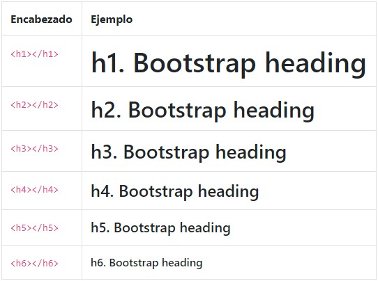

# Unidad 3

Antes de seguir deberías tener:

1. Conocimiento medio de HTML5 y CSS3. [_Repasar Uniodad 2_](/u/unidad2.md).
1. Tener a mano la [documentación de Bootstrap](https://getbootstrap.com/docs/4.1/getting-started/introduction/). (Prestar atención a la versión a utilizar)
1. Conocimiento medio del depurador de tu navegador web. (Preferentemente Google Chrome)

## Bootstrap

Es un framework Responsive Design diseñado para ayudar a diseñadores y desarrolladores en el proceso de creación de sitios web y aplicaciones de una manera rápida y fácil controlando la parte _front_ de los sitios web. Bootstrap es un proyecto Open Source (de código abierto) que podemos visualizar en [GitHub: Bootstrap](https://github.com/twbs/bootstrap).

A finales del 2012, se lanzó la versión 3 (-[_ver en GitHub_](https://github.com/twbs/bootstrap/pull/6342#issue-3439584)) que consistía en una versión más ambiciosa: Bootstrap 3 será primero para dispositivos móviles. En Agosto del 2015, Bootstrap lanzaba el _[prerelease](https://github.com/twbs/bootstrap/releases/tag/v4.0.0-alpha)_ de la versión 4, pero recién en Enero del 2018 se lanza la [versión 4.00](https://github.com/twbs/bootstrap/releases/tag/v4.0.0).

!>[Ver cambios de versión 3 a versión 4 en Bootstrap](https://getbootstrap.com/docs/4.1/migration/#summary).

### Desactivar Responsive

En la documentación de clase explica que si queremos quitar la propiedad responsive (para que la página web re-adapte el diseño cuando cambia el tamaño de la pantalla que muestra el contenido web), podemos realizar éstos pasos:

1. Quitar el meta tag "viewport"
1. Aplicar un `max-width:none !important;` en todas las páginas donde está Bootstrap funcionando.
1. Si utilizamos menus y barras de navegación, hay que analizar todas las reglas que hacen referencia a dichos elementos para eliminar el comportamiento que hará que se compriman cuando se cambia el tamaño de la pantalla.
1. Utilizar clases `.col-xs-*` (_xs = extra small_)

?>No queda claro por qué el documento de clase explica tal secuencia, si Bootstrap es un framework "pensado" para diseño responsive. Mi duda aquí, sería: ¿para qué usaríamos Bootstrap en una página donde no queremos que re-adapte ante cambios del tamaño de pantalla? :thinking:

## DOCTYPE

Bootstrap necesita que el código que usemos en nuestra web sea HTML5, por lo tanto, es obligatorio declarar el tipo de documento a través del `<!DOCTYPE html>`

## Responsive Meta

`<meta name="viewport" content="width=device-width, initial-scale=1, shrink-to-fit=no">`

Los meta tags Viewport que usan `width=device-width` causarán que la página se escale (hacia abajo) para ajustarse a los contenidos que sobresalen de los límites del _viewport_. Puedes anular este comportamiento añadiendo `shrink-to-fit=no`. El valor añadido prevendrá que la página se escale para ajustarse al _viewport_.

Si agregamos `user-scalable=no` al meta tag anterior, haremos que la página web que tiene dicho meta tag no permita que el usuario haga _**zoom**_ con el dispositivo móvil.

## Imágenes

La documentación del curso especifica que debemos usar determinadas clases para que las imágenes sean o no responsives, y aquí tenemos un problema en cuanto a versiones, pues según observo el PDF del curso está escrito para la versión 3 de Bootstrap, y mientras redacto este documento ya estamos en la versión 4 del framework.

### Responsive Images

La clase `img-responsive` está disponible en [versión 3](https://getbootstrap.com/docs/3.3/css/#images). Mientras que para la [versión 4](http://getbootstrap.com/docs/4.1/content/images/#responsive-images), se puede usar la clase `img-fluid`.

Si la imagen es una miniatura, con la versión 4 se puede aplicar la clase: `img-thumbnail` que agrega bordes redondeados a la imagen.

### Alinear elementos

Para centrar elementos, en Bootstrap 3 se recomienda usar la clase `center-block`, mientras que en la versión 4: `text-center`.

Referencias:

* [Bootstrap4: Text Alignment](http://getbootstrap.com/docs/4.1/utilities/text/#text-alignment)
* [Bootstrap4: Aligning Images](http://getbootstrap.com/docs/4.1/content/images/#aligning-images)
* [Bootstrap3: Center](https://getbootstrap.com/docs/3.3/css/#helper-classes-center)
* [Bootstrap3: Type Alignment](https://getbootstrap.com/docs/3.3/css/#type-alignment)

## Modelo de Rejilla

Modelo que divide la pantalla en _12 columnas_. Es bastante complejo de entender, ver las prácticas de las clases 5: [Grilla](https://sidval.github.io/www/testing/c5/clase5-grillas.html).

?> Recomiendo leer el modelo desde el sitio oficial de Bootstrap: [Grid System](http://getbootstrap.com/docs/4.1/layout/grid/).

Bootstrap usa [Flexbox](/c/css/flexbox.md) para mejorar el modelo de [Layout CSS Grid](https://developer.mozilla.org/en-US/docs/Web/CSS/CSS_Grid_Layout).

El modelo de rejilla es un elemento importante de un marco de CSS, ya que la creación de diseños complejos sin un sistema de cuadrícula potente y flexible puede ser una tarea intimidante.

Entre las nuevas características del último sistema de cuadrícula Bootstrap (versión 4), encontramos el punto de corte de la cuadrícula `xl` (extra grande), que corresponde a un tamaño de pantalla extra grande, y el uso de _Flexbox_ en lugar de flotadores como el mecanismo de diseño subyacente.

### Conceptos claves

Lo más importante cuando se piensa en encolumnados (el modelo de rejilla, o CSS Grid) es lo siguiente:

* `.container`
* `.row`
* `.col-*-*`

#### Container

El contenedor es el envoltorio externo para el diseño de la cuadrícula. Es un `div` que tiene o el contenedor de clase para ancho fijo o `.container-fluid` para un ancho completo del 100%.

#### Row

La class `row` hace referencia a una _fila_ y sirve como un contenedor lógico para las columnas.

#### Column

Una columna es lo que hace un bloque en la grilla. Debe estar contenido en una fila.

El sistema de rejilla Bootstrap (o encolumnado) proporciona estas clases de columnas:

* `.col-xs-*`: diseñado para pantallas extrapequeñas de menos de 576px de ancho
* `.col-sm-*`: diseñado para pantallas pequeñas con un ancho igual o superior a 576px
* `.col-md-*`: diseñado para pantallas medianas con un ancho mayor o igual a 768px
* `.col-lg-*`: diseñado para pantallas grandes con ancho mayor o igual a 992px
* `.col-xl-*`: diseñado para pantallas extra grandes que tienen un ancho igual o superior a 1200px

>No es necesario agregar varias clases si se desea especificar el mismo ancho para diferentes tamaños de pantalla; solo agrega la clase con el punto de corte más pequeño. Por ejemplo, en lugar de `.col-sm-6` y `.col-md-6`, solo necesita aplicar `.col-sm-6`.

!>Hay un artículo (en inglés) muy interesante sobre [cómo dominar el modelo rejilla de Bootstrap 4](https://www.sitepoint.com/bootstrap-grid-mastering-flexbox/).

## Media Queries

Las "media queries" de bootstrap son quizás lo más importante junto al encolumnado (el modelo de rejilla). Se utilizan para establecer distintos puntos de ruptura dentro del código, que mostrarán distintos estilos de acuerdo al tamaño establecido de la pantalla que se use para mostrar el contenido.

En la documentación oficial de Bootstrap estas _media queries_ las encontramos como [Responsive breakpoints](https://getbootstrap.com/docs/4.1/layout/overview/#responsive-breakpoints).

```css
// Dispositivos extra pequeños (celulares de menos de 576px)
// No hay consulta de medios para `xs` ya que este es el predeterminado en Bootstrap

// Dispositivos pequeños (celulares apaisados, mayor a 576px)
@media (min-width: 576px) { ... }

// Dispositivos medianos (tabletas, 768px y más)
@media (min-width: 768px) { ... }

// Dispositivos grandes (escritorios, 992px y más)
@media (min-width: 992px) { ... }

// Dispositivos extragrandes (escritorios grandes, 1200px y más)
@media (min-width: 1200px) { ... }
```

## Resetear columnas

En Bootstrap 4 podemos usar la clase `.clearfix`.

Ver ejemplo práctico:
<script async src="//jsfiddle.net/Waldo/Lozm1wnr/embed/html,result/"></script>

## Ordenando Columnas

En Bootstrap es posible ordenar las columnas indistintivamente de cómo éstén agregadas vía HTML. Si bien en versión 3 de Bootstrap se usa [_push/pull_](https://getbootstrap.com/docs/3.3/css/#grid-column-ordering), en la versión 4 usaremos la class [.order](https://getbootstrap.com/docs/4.1/layout/grid/#order-classes).

```css
<div class="container">
  <div class="row">
    <div class="col">
      Primer columna en HTML, sin orden
    </div>
    <div class="col order-12">
      Segunda en HTML, pero al último
    </div>
    <div class="col order-1">
      Tercera en HTML, primera en mostrarse
    </div>
  </div>
</div>
```

El código CSS anterior, se vería así:

<script async src="//jsfiddle.net/Waldo/40esfgx1/embed/result/"></script>

También hay clases responsive `.order-first` y `.order-last` que cambian el orden de un elemento al aplicar el `order: -1` y el `order: 13` que sería `(order: $columns + 1)` respectivamente. Estas clases también pueden entremezclarse con las clases numeradas `.order-*`  según sea necesario.

## Compensar Columnas

Puede compensar las columnas de la cuadrícula de dos maneras:

* Clases responsive `.offset-`
* Utilidades de margen

Las clases de cuadrícula se dimensionan para coincidir con las columnas, mientras que los márgenes son más útiles para diseños rápidos donde el ancho del desplazamiento es variable.

### Offset

Mueva las columnas hacia la derecha usando las clases `.offset-md-*`. Estas clases aumentan el margen izquierdo de una columna por `*`  columnas. Por ejemplo, `.offset-md-4` mueve `.col-md-4` en cuatro columnas. En la documentación del curso, aparece como opción para "desplazar" columnas.

```css
<div class="row">
  <div class="col-md-4">.col-md-4</div>
  <div class="col-md-4 offset-md-4">.col-md-4 .offset-md-4</div>
</div>
<div class="row">
  <div class="col-md-3 offset-md-3">.col-md-3 .offset-md-3</div>
  <div class="col-md-3 offset-md-3">.col-md-3 .offset-md-3</div>
</div>
<div class="row">
  <div class="col-md-6 offset-md-3">.col-md-6 .offset-md-3</div>
</div>
```

[Se verá así](https://jsfiddle.net/Waldo/bo8snce0/1/). Jugar con los margenes, si está ampliado no verán las columnas.

### Utilidades de margen

Con la transición a flexbox en v4, puede usar utilidades de margen como `.mr-auto` para separar las columnas entre sí. Ampliar información sobre el [`.mr-auto`](https://getbootstrap.com/docs/4.1/layout/grid/#margin-utilities).

## Anidar Columnas

Para anidar su contenido con la cuadrícula predeterminada, agregue un nuevo `.row` y un conjunto de columnas `.col-sm-*` dentro de una columna existente `.col-sm-*`.

## Tipografía

### Encabezados

El encabezado se conoce como _heading_ y debemos tener en cuenta que el `margin-top` de éstos elementos se quitó. Tienen un `margin-bottom: .5rem` mientras que los párrafos tienen un `margin-bottom: 1rem` para facilitar su espaciado.

Es más fácil representarlo con una imágen que explique cómo se verían los distintos elementos de HTML:



Si queremos jugar con un poco de código HTML y ver cómo queda, podemos ver el código aquí:

<script async src="//jsfiddle.net/Waldo/7g53vxvp/embed/html,result/"></script>

Los elementos de encabezado tradicionales están diseñados para funcionar mejor en el contenido de su página. Cuando necesite un encabezado para destacarse, considere usar un encabezado `.display`: un estilo de encabezado más grande y ligeramente más dogmático.

Por ejemplo:

```html
<h1 class="display-1">Display 1</h1>
<h1 class="display-2">Display 2</h1>
<h1 class="display-3">Display 3</h1>
<h1 class="display-4">Display 4</h1>
```

### Elementos de texto

Hay distintos estilos que podemos darle a los elementos de texto; en Bootstrap 4 los encontramos como [#inline-text-elements](https://getbootstrap.com/docs/4.1/content/typography/#inline-text-elements). Los más interesantes son `<small>` y `<mark>`. Y dentro del elemento `<small>` se podría agregar la class `.text-muted` por ejemplo.

Ver ejemplo en línea de cómo trabajan los [estilos en texto](https://jsfiddle.net/Waldo/p18ansx7/).

Cambie la alineación de texto, la transformación, el estilo, el peso y el color con [utilidades de texto](https://getbootstrap.com/docs/4.1/utilities/text/) y [utilidades de color](https://getbootstrap.com/docs/4.1/utilities/colors/).

Se puede destacar texto en un párrafo usando la class `.lead`.

### Abreviaciones

Implementación estilizada del elemento `<abbr>` de HTML para las abreviaturas y los acrónimos para mostrar la versión expandida cuando el mouse (ratón) está arriba del texto (`:hover`). Las abreviaturas tienen un subrayado predeterminado y obtienen un cursor de ayuda para proporcionar contexto adicional en el vuelo estacionario y para los usuarios de tecnologías de asistencia.

Podemos agregar la class `.initialism` a una abreviatura para un tamaño de letra ligeramente más pequeño.

<script async src="//jsfiddle.net/Waldo/p4m7Lnh5/embed/result/"></script>

### Citas Textuales

Para citar bloques de contenido de otra fuente dentro de su documento. Ajustar el elemento `<blockquote>` con la class `.blockquote` alrededor de cualquier HTML como la cita.

Si estamos indicando quién dijo la cita textual, podemos usar la class `.blockquote-footer`, por ejemplo:

```css
<blockquote class="blockquote">
  <p class="mb-0">Lorem ipsum dolor sit amet, consectetur adipiscing elit. Integer posuere erat a ante.</p>
  <footer class="blockquote-footer">Someone famous in <cite title="Source Title">Source Title</cite></footer>
</blockquote>
```

Se verá:

<script async src="//jsfiddle.net/Waldo/9mdk4cwy/embed/result/"></script>

### Alinear texto

Podemos usar class `.text-center` para alinear al centro, o bien `.text-right` para alinear a la derecha.

### Otros elementos

* [Listas](https://getbootstrap.com/docs/4.1/content/typography/#lists)
* [Tamaños Responsive](https://getbootstrap.com/docs/4.1/content/typography/#responsive-typography)

## Códigos

Para código en una línea, se usa `<code>`. Asegúrese de escapar de los corchetes angulares de HTML.

`Por ejemplo, <code>&lt;section&gt;</code>.`

Se vería así: `&lt;section&gt;`

### Bloques de código

Use `<pre>` para múltiples líneas de código. Una vez más, asegúrese de escapar de los corchetes angulares en el código para una representación adecuada. Opcionalmente, puede agregar la clase `.pre-scrollable`, que establecerá una altura máxima de 340px y proporcionará una barra de desplazamiento del eje vertical.

### Variables

Use el elemento HTML `<var>` para poner variables.

### Teclas

Para indicar teclas del teclado, por ejemplo: "Presionar Ctrl + F para buscar..." debemos usar el elemento `<kbd>`.

Se vería así:
<script async src="//jsfiddle.net/Waldo/n1uovm6p/embed/result/"></script>

### Salida

Para indicar lo que "sale" de un programa (como resultado), debemos usar el elemento HTML: `<samp>`.

## Tablas

[Ampliar aquí](https://getbootstrap.com/docs/4.1/content/tables/).

## Imagenes

[Ampliar aquí](https://getbootstrap.com/docs/4.1/content/images/).

## Utilidades

* [Bordes](https://getbootstrap.com/docs/4.1/utilities/borders/)
* [ClearFix](https://getbootstrap.com/docs/4.1/utilities/clearfix/)
* [Icono para cerrar](/u/unidad3.md#icono-para-cerrar)
* [Colores](https://getbootstrap.com/docs/4.1/utilities/colors/)
* [Propiedad Display](https://getbootstrap.com/docs/4.1/utilities/display/)
* [Embebidos](https://getbootstrap.com/docs/4.1/utilities/embed/)
* [Flex](https://getbootstrap.com/docs/4.1/utilities/flex/)
* [Float](https://getbootstrap.com/docs/4.1/utilities/float/)
* [Reemplazar Imágenes](https://getbootstrap.com/docs/4.1/utilities/image-replacement/)
* [Posición](https://getbootstrap.com/docs/4.1/utilities/position/)
* [Screenreaders](https://getbootstrap.com/docs/4.1/utilities/screenreaders/)
* [Sombas](https://getbootstrap.com/docs/4.1/utilities/shadows/)
* [Sizing](https://getbootstrap.com/docs/4.1/utilities/sizing/)
* [Spacing](https://getbootstrap.com/docs/4.1/utilities/spacing/)
* [Textos](https://getbootstrap.com/docs/4.1/utilities/text/)
* [Vertical-Align](https://getbootstrap.com/docs/4.1/utilities/vertical-align/)
* [Visibility](https://getbootstrap.com/docs/4.1/utilities/visibility/)

### Icono para cerrar

Use un icono de cierre genérico para descartar contenido como modales y alertas.

```html
<button type="button" class="close" aria-label="Close">
  <span aria-hidden="true">&times;</span>
</button>
```

## Formularios

Varios elementos de formulario se han reiniciado para estilos de base más simples. Estos son algunos de los cambios más notables:

* `<fieldset>` no tienen bordes, relleno o margen, por lo que se pueden usar fácilmente como envoltorios para entradas individuales o grupos de entradas.
* `<legend>`, como fieldsets, también se han rediseñado para mostrarse como un tipo de encabezado.
* `<label>`están configurados para `display: inline-block` para permitir que el `margin` se aplique.
* `<input>`, `<select>`, `<textarea>`, y `<button>` son tratados principalmente por _Normalize_, pero _Reboot_ elimina su margen y establece `line-height: inherit`, también.
* `<textarea>`, se modifica para que solo se puedan redimensionar verticalmente, ya que el cambio de tamaño horizontal a menudo "rompe" el diseño de la página.

Ampliar con [forms](https://getbootstrap.com/docs/4.1/content/reboot/#forms).

## Componentes

* [Alertas](https://getbootstrap.com/docs/4.1/components/alerts/)
* [Badges](https://getbootstrap.com/docs/4.1/components/badge/)
* [Breadcrumb](https://getbootstrap.com/docs/4.1/components/breadcrumb/)
* Otros (completar listado).

### Iconos

Los _glyphicons_ que están disponibles en la versión 3 de Bootstrap (ver [lista aquí](http://marcoceppi.github.io/bootstrap-glyphicons/)) ya no están disponibles en su versión 4; en cambio, se recomienda [cómo extender el uso aquí](https://getbootstrap.com/docs/4.1/extend/icons/).

### Cards

En la documentación se habla de "paneles" (porque es de Bootstrap versión 3), pero con la nueva versión, ya estamos en versión 4.
